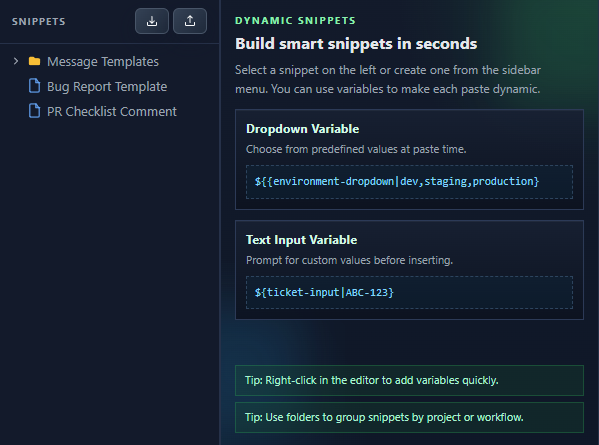
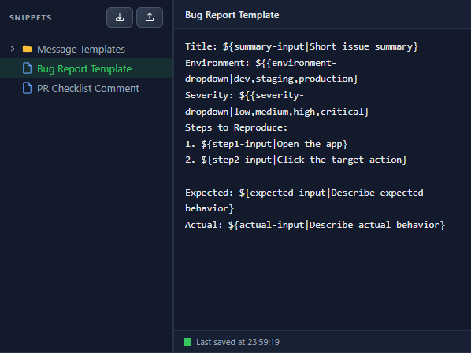
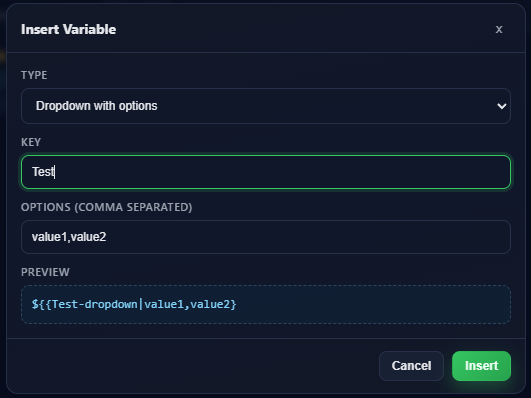
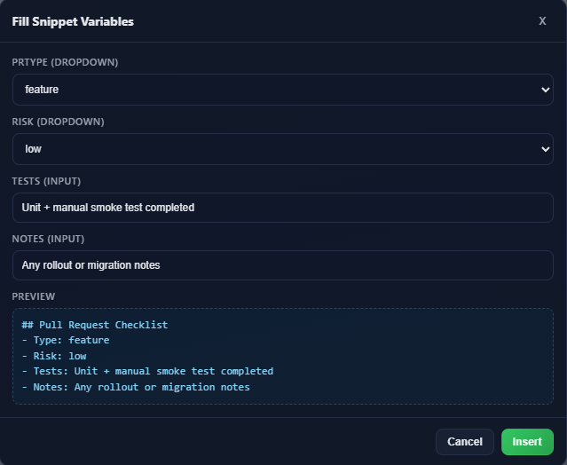

<div align="center">

# ⚡ Dynamic Snippets

**Save, organize, and instantly paste reusable text snippets with dynamic variables.**

[](https://chromewebstore.google.com/detail/lhpmacoeaepkocgkhamlnaalpifhckjm?utm_source=item-share-cb)
[](LICENSE)
[](https://vuejs.org)

<br />



</div>

---

## ✨ Features

| Feature | Description |
|---|---|
| 📁 **Folder Tree** | Organize snippets in a draggable, nested folder structure |
| 🔀 **Dynamic Variables** | Dropdown selectors (`${{key\|opt1,opt2}}`) and text inputs (`${key\|default}`) that prompt at paste time |
| 🖱️ **Right-Click Insert** | Paste any snippet from the context menu on any website |
| 🛠️ **Variable Builder** | Visual modal to create variable tokens — no syntax to memorize |
| 💾 **Auto-Save** | Configurable debounce with a live save status indicator |
| 🎨 **Dark & Light Themes** | Switch between themes from the settings panel |
| 📦 **Import / Export** | Back up or share your entire snippet library as JSON |
| 📋 **Built-in Templates** | Starter snippets for bug reports, PR checklists, and message templates |

## 📸 Screenshots

<div align="center">
<table>
<tr>
<td align="center"><br /><b>Snippet Editor</b></td>
<td align="center"><br /><b>Variable Builder</b></td>
</tr>
<tr>
<td align="center"><br /><b>Variable Input Prompt</b></td>
<td align="center"><br /><b>Welcome Screen</b></td>
</tr>
</table>
</div>

## 🚀 Getting Started

### Prerequisites

- [Node.js](https://nodejs.org/) 18+
- npm

### Install & Build

```bash
# Clone the repo
git clone https://github.com/Chosen-Marsh/Dynamic-snippets.git
cd Dynamic-snippets

# Install dependencies
npm install

# Build for production
npm run build
```

### Development

```bash
npm run dev
```

### Load in Browser

1. **Chrome** — Go to `chrome://extensions` → enable **Developer mode** → **Load unpacked** → select the `dist` folder
2. **Edge** — Go to `edge://extensions` → enable **Developer mode** → **Load unpacked** → select the `dist` folder

## 🧩 How It Works

```
1. Click the extension icon to open the snippet manager
2. Create folders and snippets, add variables if needed
3. Right-click any text field on any page → pick your snippet
4. Fill in variable prompts → text is inserted instantly
```

## 🏗️ Tech Stack

| Technology | Purpose |
|---|---|
| [Vue 3](https://vuejs.org/) | Reactive UI with Composition API |
| [Vite](https://vite.dev/) | Lightning-fast build tooling |
| Chrome Extension MV3 | Service worker, context menus, scripting API |
| `chrome.storage.local` | Local persistence — no external servers |

## 🔒 Privacy

Dynamic Snippets collects **zero user data**. Everything is stored locally in your browser. See the full [Privacy Policy](PRIVACY.md).

## 📄 License

CC BY-NC 4.0 © [Marsh](https://github.com/Chosen-Marsh) — Free to use and adapt, but not for commercial purposes.
